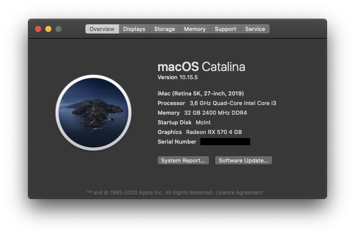

# Hackintosh-Z370-I9100F-RX570-OpenCore
Description and sort-of buildlog of my Hackintosh.

# Opencore(0.5.8) configuration on Asus Z370-A II

### Why
- Challenge :)
- 2TB storage from Apple for a Mac(book?) is unreasonably expensive, have been happily paying Apple tax for a while but I just found my limit.
- Don't depend on my own Mac for work anymore, feel more free to experiment.
- See the end of OSX use for me coming up, so also experiment with Win10/Linux on desktop.

### Hardware

- Asus PRIME Z370-A II 
- Intel Core i3 9100F (no built in iGPU)
- Be quiet Shadow Rock LP Low Profile CPU cooler, upgraded from boxed Intel cooler. Way cooler and whisper quiet.
- Asus Strix Radeon RX570 4gb videocard (bought second hand)
- 2 * Corsair DDR4 LPX 16GB 3200MHz
- Kingston A2000 500GB NVMe SSD (OSX) (out of Odroid where it didn't work)
- Kingston A2000 250GB NVMe SSD (Windows 10/Linux) (out of Odroid where it didn't work)
- Crucial MX1000 1TB SATA SSD for photo's, movies, music and virtual machines.
- Western Digital 6TB SATA spinning disk for back-ups of this and other systems.
- Cooler Master MWE Bronze 550 V2
- Generic ATX Case from 20+ years ago out of 'deep storage'
- Dell U2410 1920 x 1200
- Dell P2412H 1920 x 1080
- Philips 200WS 1680 x 1050

### Process
- Subscribed to [Hackintosh subreddit](http://reddit.com/r/hackintosh/) and read up on succesful builds.
- Figured out Open Core is the way forward. Quite a good time to start Hackintoshing!
- Read up on guide on [Dortania](https://github.com/dortania/OpenCore-Desktop-Guide)
- Started picking hardware found simple advice somewhere (if I re-find the link I'll add it here): do Intel CPU, AMD video and 300 series Motherboard so took this as a baseline.
  - Hardware I considered at first and why I didn't pick them:
    - B365 chipset, later found out the easier way (citation needed) is the older Z370 chipset, motherboards using this are a bit more expensive but I was willing to pay a little more for lesser hassle (the challenge shouldn't be too big ;))
    - i5 9400F, maybe the extra cores would be handy long term but for now the quad core i3 is enough for me, budget suggested the 9100
    - AMD RX580 with 8GB, bought the 4GB RX570 second hand locally, was the first hardware purchase for this project, quick budget fix. 
- Used Userbenchmark and Tweakers Pricewatch for a performance indication and total cost compared to my MacBook.
- Found that quite a lot of buildlogs are on GitHub, jay! This helped me settle on the Z370 motherboard.
- June 2020: Ordered Motherboard, processor, memory and power supply online, delivered within 16 hours!
- Built the hardware into my old ATX case, fit like a charm.
- Oogled the graphical UEFI 'bios'.
- Ran Memtest86 for a couple of hours.
- Installed Windows 10 from USB stick, worked flawlessly.
- Ran [Heavyload](https://www.jam-software.com/heavyload) for a while, no issues.
- Quite confident in the hardware and my rusty pc-build skills.
- In about five hours I got OSX installed using the [vanilla desktop guide](https://github.com/dortania/OpenCore-Desktop-Guide).
  - Made one mistake, I missed one of the kexts on my USB disk. At first I didn't realise this and tried to boot, after chasing my tail trying to debug I fixed it in about 30 minutes.
- Celebrated by installing Steam and playing some Factorio :)
- Mapped USB ports using [KTGWKenta's work](https://github.com/KTGWKenta/Hackintosh-Asus-Z370a), this seems to work. But I haven't properly tested it yet and based on further research KTGWKenta has a slightly different motherboard. 
- After 2 weeks: Added more storage after verifying everyting works: 1TB SSD for media and 6TB disk for backups.
- After 4 weeks: Upgraded CPU cooler to an 'be quiet Shadow Rock LP', once it got hotter the noise became hard to ignore. After the upgrade it's SO much better.

#### Working

- CPU Turbo Boost
- Ethernet, 1000MBit (fixed my 100MBit problem with a new cable :-S)
- Onboard Audio Output
- Sleep/Wake
- All USB ports Patched (I think*)
- iMessage
- App Store
- Facetime
- Windows multiboot
- Steam
- ~~Bluetooth~~, no card yet, plan on Fenvi T919
- ~~Wi-Fi~~
- ~~Airdrop~~

#### Plans

- Prettify the boot process, lessen the debugging info
- Get Fenvi T919
- Properly test USB speeds
- Memory XMP, useful?
